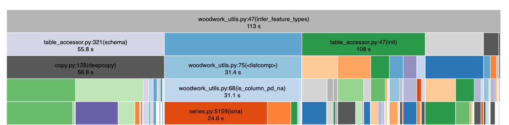
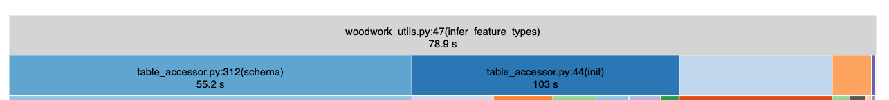

+++
title = "Why the Order Boolean Expressions Matters in Python"

date = 2021-08-23
lastmod = 2021-08-23
draft = false

authors = ["Freddy Alfonso Boulton"]

tags = []

summary = "`if True or False` could be slower than `if False or True`!"

projects = []

# Featured image
# To use, add an image named `featured.jpg/png` to your project's folder. 
[image]
  # Caption (optional)
  caption = "Photo by israel palacio on Unsplash"

  # Focal point (optional)
  # Options: Smart, Center, TopLeft, Top, TopRight, Left, Right, BottomLeft, Bottom, BottomRight
  focal_point = "Center"

  # Show image only in page previews?
  preview_only = false

+++

The EvalML team benchmarks our AutoML algorithm on a set of regression and classification datasets before we release a new version of our package.

In the 0.31.2 release, a colleage of mine noted that our algorithm was about 10% slower on a dataset used in the [KDDCup](https://kdd.org/kdd-cup) competition. In this post, I describe how I went about identifying and fixing the cause of this slowdown. You should come away with an understanding of how you can leverage python's evaluation order to speed up the evaluation of some boolean expressions.

First, I created a minimal reproducer of EvalML's AutoML algorithm running on the KDDCup dataset so that I could profile it using [CProfile](https://docs.python.org/3/library/profile.html#module-cProfile). This is what the reproducer looked like:

```python
import pandas as pd
from evalml.automl import AutoMLSearch
from evalml.preprocessing import split_data

X = pd.read_csv("/Users/freddy.boulton/Downloads/KDDCup09_churn.csv")
y = X.pop("CHURN")

X_train, X_validation, y_train, y_validation = split_data(X, y, problem_type="binary",
                                                          test_size=0.5, random_seed=0)
automl = AutoMLSearch(X_train, y_train, "binary")
automl.search()
```

I profiled the code using EvalML version 0.31.2 and 0.31.0 (the latest version without the performance slowdown). I then used [snakeviz](https://jiffyclub.github.io/snakeviz/) to visualize the profiler output. I verfied that version 0.31.2 took 30 seconds (about 10%) longer than version 0.31.0.

To my delight, a function called `infer_feature_types` that is used during `AutoMLSearch` took about 30 seconds longer with version 0.31.2. It seems like the slowdown is entirely attributed to a change in `infer_feature_types`!

##### Time spent running infer_feature_types in version 0.31.2



##### Time spent running infer_feature_types in version 0.31.0


Looking at the source code, I noticed that there was a bit of code that was introduced in version 0.31.2 that identified which columns were all `NaN` (missing values) and had an `Unknown` type.

As an aside, EvalML uses [woodwork](https://woodwork.alteryx.com/en/stable/) to identify and track the type of each column. This lets `AutoMLSearch` automatically transform columns with the right preprocessing components needed to build a good machine learning model. For example, if a feature is of type `Categorical`, the algorithm will use a one-hot encoding. 

This is what that piece of code looked like:

```python
all_null_unk_cols = [
    col
    for col in data.columns
    if (is_column_pd_na(data, col) and is_column_unknown(data, col))
]
```

When I saw this, the problem was clear - `is_column_pd_na` is an expensive operation because it needs to check if all elements of the column are missing whereas `is_column_unknown` just checks if the feature type of the column is `Unknown` by essentially doing a dictionary lookup. 

In python, expressions evaluate from left to right. That means that to evaluate `a and b`, the interpreter must first check the value of `a` and then the value of `b`. However, since this is an `and` statement, the value of `a` does not matter if we know `b` is false! You can see this principle at play in the following code-snippet:

##### Showing that python evaluates expressions from left to right


Once I switched the order of the expressions so the faster one went first, the time spent in ``infer_feature_types`` went back to what it was before!


This miniature case study illustrates that python evaluates expressions from left to right and how you can leverage that fact to identify and eliminate bottlenecks in your code. I also want to emphasize that `cProfile` and `snakeviz` are fantastic tools that you should use when profiling your own code!